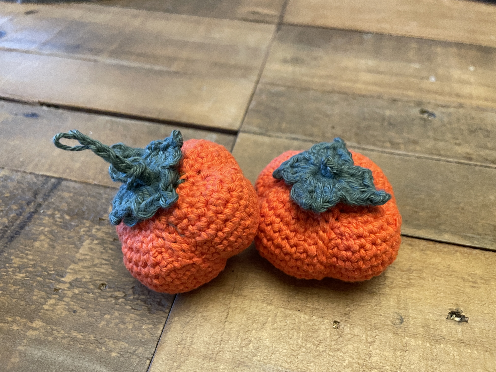
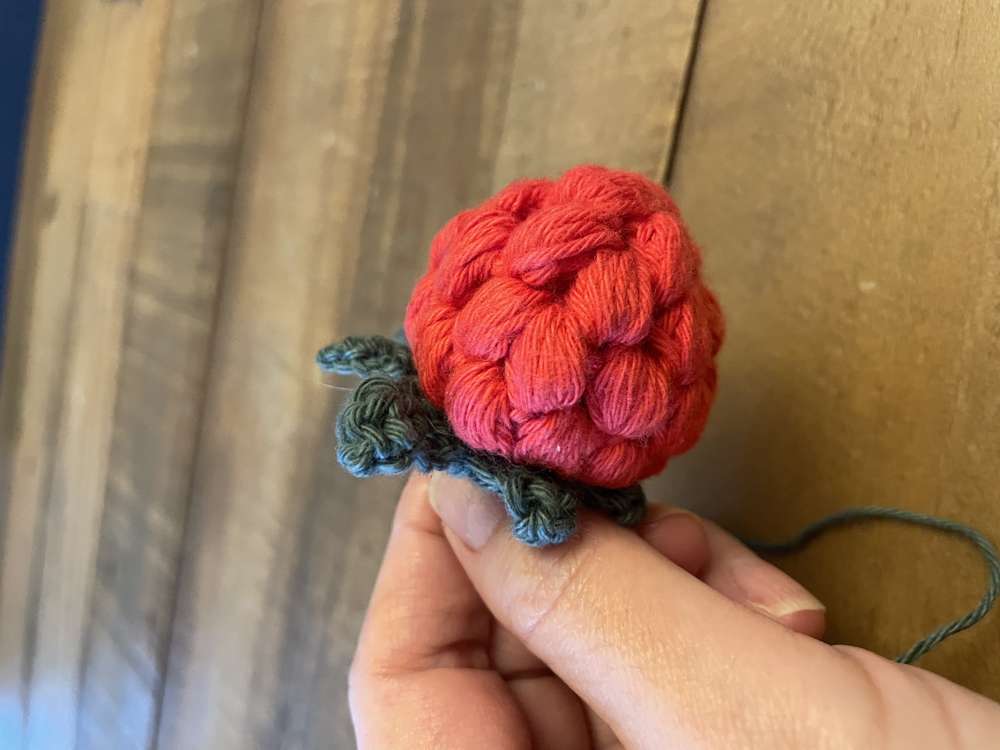

My work keeps me tied to the computer most of time. When I am not working, I really enjoy hands-on making. I like creating things that are cute, beautiful and sometimes even practical and edible, through activities such as crocheting and cooking. Below are some of my recent works.

 
*Persimmon. In Chinese, persimmon (柿, "shì" ) sounds like things/matters (事, "shì"), so the picture means "May everything go as you wish", symbolizing good fortune, success, and happiness, often seen during Chinese New Year*

 
*This horse was created for the new year 2026, which is Chinese horse year. There is a Chinese idiom "马到成功” which means "success with the horse arriving" or immediate success*

 
*Strawberry*

 
*Something more practical :-) *

 
*I am really pleased to find that I could make Mochi myself at home*

 
*home made Douhua*

When the weather is nice, which is not so usual in Scotland, I also enjoy  <a href="https://xianghuading.github.io/hiking">hiking</a> wheven time allows.  

