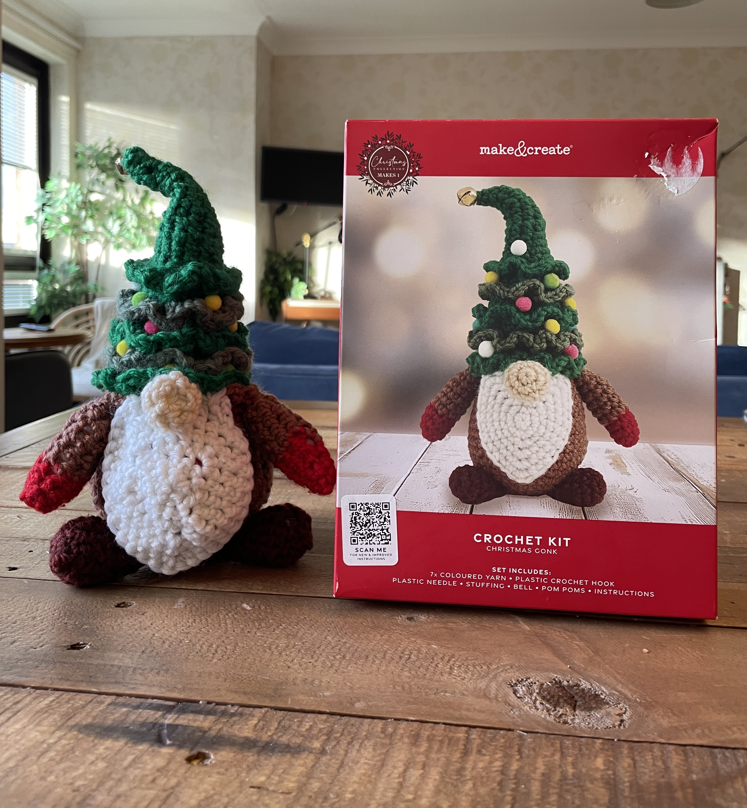
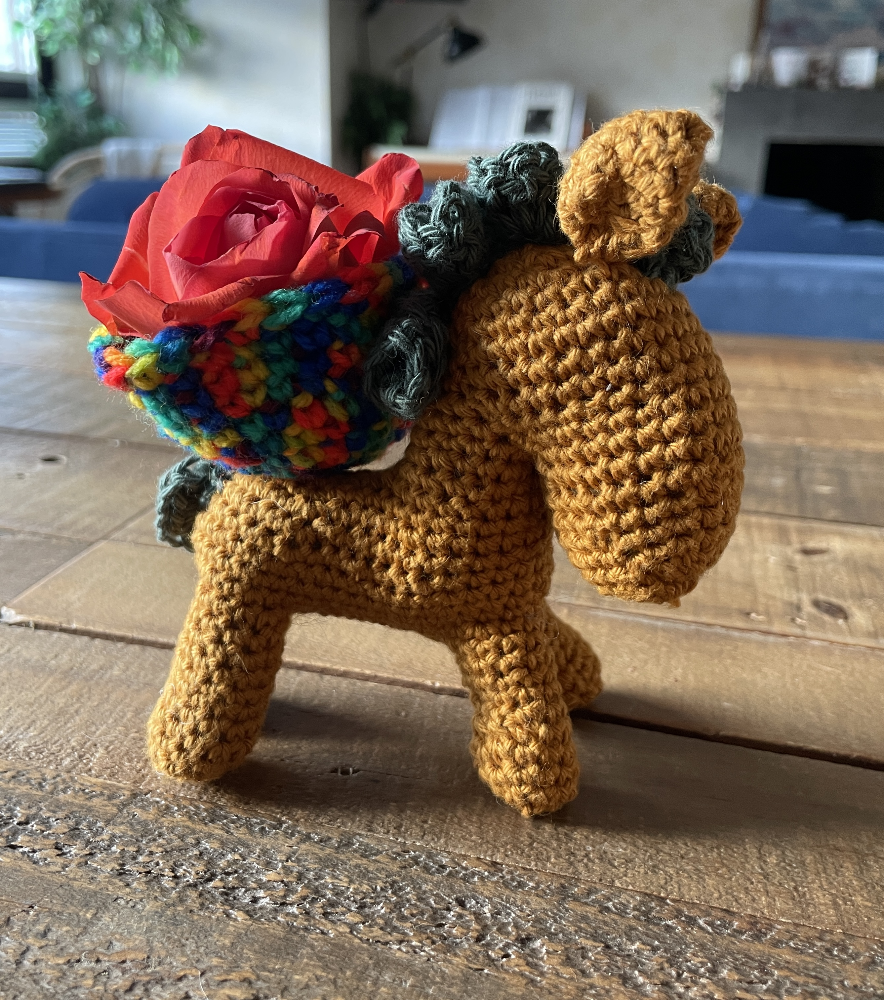
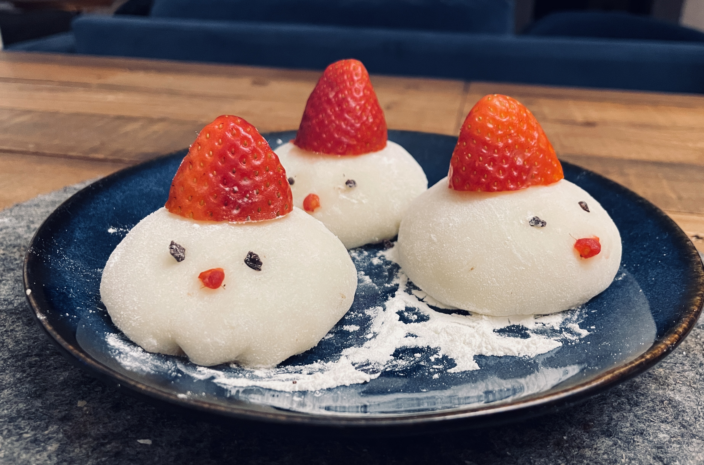
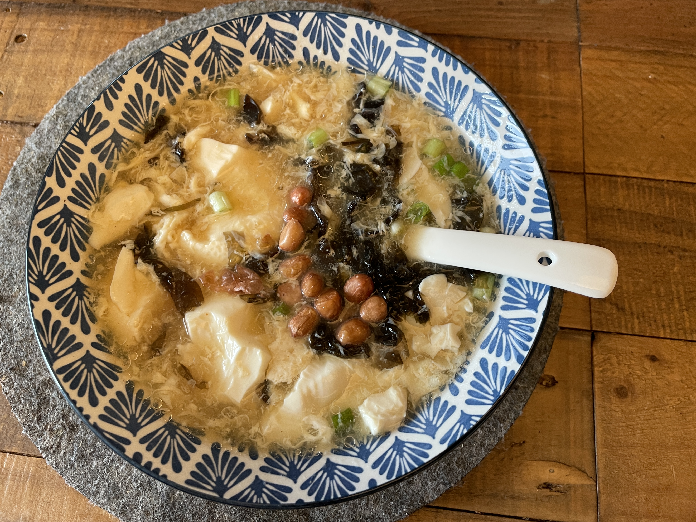

My work keeps me tied to the computer most of time, so when I am not working, I really enjoy stepping away through hands-on making. I like creating things that are cute, beautiful and sometimes even practical, such as cooking and crocheting. By keeping my hands busy, they help me switch off from work, and stay sane.  
Some recent works from crocheting:
 
 

Some recent works from cooking:
 
 

When the weather is nice, which is not so usual in Scotland, I also enjoy  <a href="hiking.md">hiking</a> wheven time allows.  

