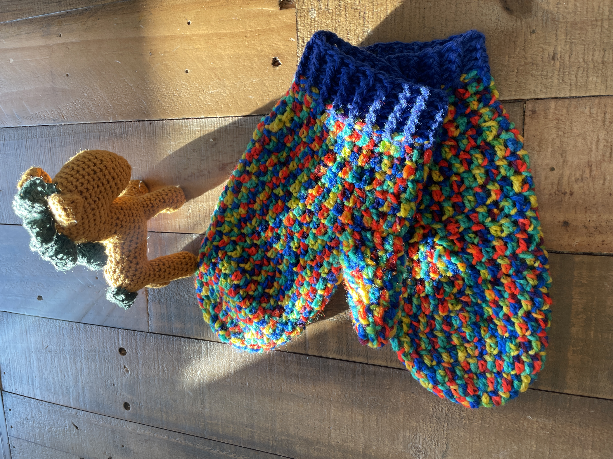

My work keeps me tied to the computer most of time, so when I am not working, I really enjoy stepping away through hands-on making. I like creating things that are cute, beautiful and sometimes even practical, such as cooking and crocheting. By keeping my hands busy, they help me switch off from work, and stay sane.  Below are some of my recent works.

This is my very first crochet project where my crochet journey began:

 

This horse was created for the new year 2026, which is Chinese horse year:

 

I've also made something more practical:

 

I am really pleased to find that I could make Mochi myself at home:

 

I am really happy to find a way to make Douhua myself in the UK:

 

When the weather is nice, which is not so usual in Scotland, I also enjoy  <a href="https://xianghuading.github.io/hiking">hiking</a> wheven time allows.  

